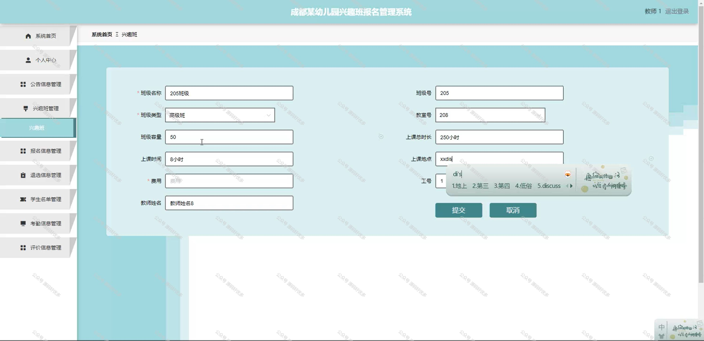
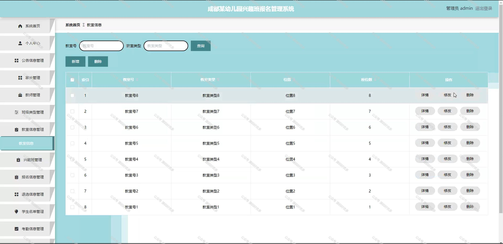
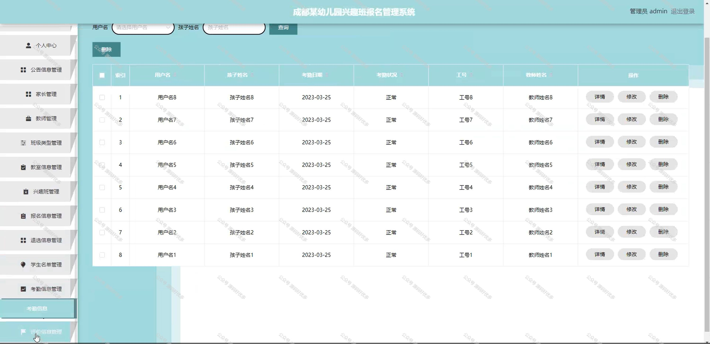

 
## 查看主页获取源码

> **作者介绍**： **✌**全网粉丝10W+本平台特邀作者、博客专家、CSDN新星计划导师、java领域优质创作者,博客之星、掘金/华为云/阿里云/InfoQ等平台优质作者、专注于项目实战 **✌**

  

### 一、作品包含

源码+数据库+全套环境和工具资源+部署教程

### 二、项目技术

前端技术：Html、Css、Js、Vue、Element-ui

数据库：MySQL

后端技术：Java、Spring Boot、MyBatis

  

### 三、运行环境

开发工具：IDEA/eclipse

数据库：MySQL5.7

数据库管理工具：Navicat10以上版本

环境配置软件： JDK1.8+Maven3.6.3

前端Nodejs：14

### 四、项目介绍
项目编号：springbootA136

在成都市，随着家长对幼儿全面素质教育的重视，幼儿园兴趣班成为了孩子们课余生活的重要组成部分。为了更高效地管理兴趣班的报名流程、课程安排和资源分配，成都某幼儿园开发了一套兴趣班报名管理系统。该系统旨在简化报名流程，提高管理效率，确保兴趣班活动的有序开展，同时为家长提供便捷的报名通道和实时的课程信息查询服务。

系统分为管理员、教师、家长。
管理员的功能：系统首页、个人中心、公告信息管理、家长管理、教师管理、班级类型管理、教室信息管理、兴趣班管理、报名信息管理、退选信息管理、学生名单管理、考勤信息管理、评价信息管理。
教师的功能：系统首页、个人中心、公告信息管理、兴趣班管理、报名信息管理、退选信息管理、学生名单管理、考勤信息管理、评价信息管理。
家长的功能：系统首页、个人中心、公告信息管理、兴趣班管理、报名信息管理、退选信息管理、考勤信息管理、评价信息管理。

### 五、运行截图

  
